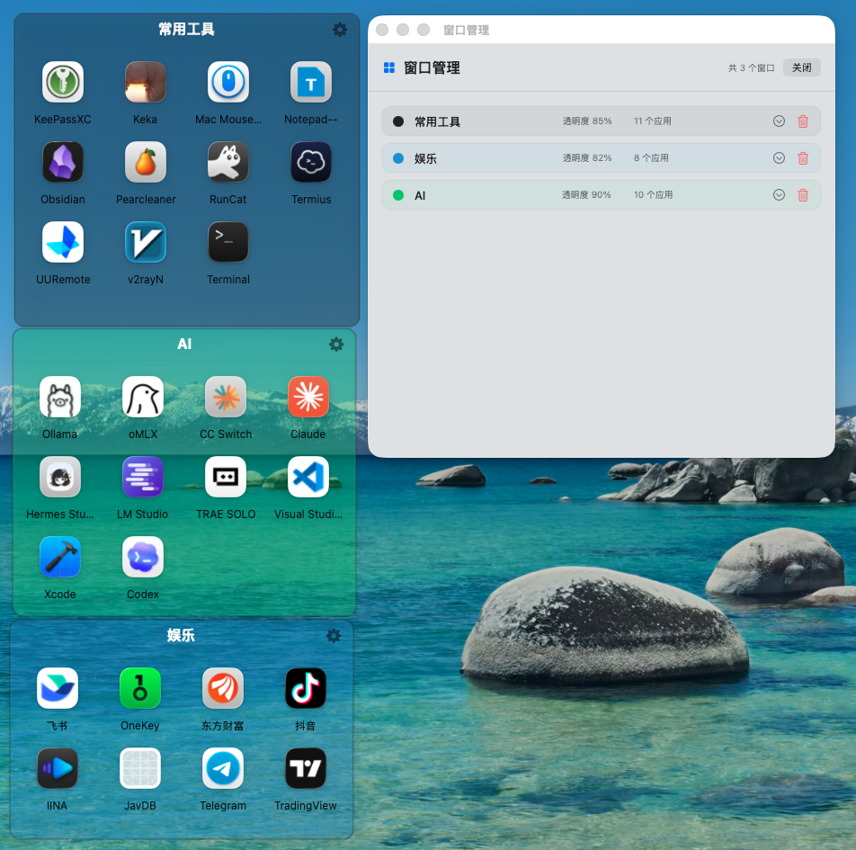

# Quick Open

Quick Open 是一个轻量的 macOS 桌面快捷方式整理工具。它常驻菜单栏，可以创建多个悬浮在桌面层的快捷窗口，并通过拖放管理常用应用。

## 功能

### 快捷窗口

- 创建多个独立的快捷方式窗口
- 从 Finder 拖入 `.app` 应用
- 点击图标快速启动应用
- 调整窗口位置和大小
- 图标自适应窗口大小，窗口缩小时自动压缩图标、文字和间距
- 修改窗口名称、主题色、标题颜色和透明度
- 设置或清除窗口背景图片
- 管理和删除已有窗口
- 自动保存窗口布局与快捷方式
- 支持登录 Mac 后自动启动
- 可显示在所有桌面空间

### 窗口行为

- 支持贴边自动隐藏，鼠标划过可见区域后自动展开
- 支持窗口边缘吸附对齐，可在设置中开关
- 支持自定义贴边隐藏延迟、露出宽度和启用边缘
- 调整窗口大小时不会触发窗口吸附，避免 resize 手感被干扰

### 小宠物触发器

- 贴边隐藏后显示卡通小宠物，窗口展开后自动隐藏
- 支持狐狸、浣熊、小熊、猫头鹰、小猫、小狗、兔子、熊猫、企鹅、仓鼠
- 每个窗口都可以在自己的设置按钮中单独选择小宠物
- 未单独选择的小宠物窗口会跟随全局默认设置
- 小宠物旁显示窗口名称牌，名称随窗口标题自动更新
- 小宠物图片显示时会裁掉透明留白，贴边隐藏后更贴近屏幕边框

### AI 仪表盘

- 窗口管理器中可创建独立的 AI 仪表盘窗口
- AI 仪表盘窗口可像普通窗口一样移动、缩放、贴边隐藏和删除
- AI 数据显示在仪表盘窗口内，不再放在总设置中
- AI 仪表盘窗口右上角设置按钮可配置 Codex、Claude Code 周额度余量和续费日期
- 国内模型 token 可备份到本机 Keychain，并支持手动记录 token 余额

## 软件界面



## 从第一版到当前版的更新摘要

第一版的 Quick Open 主要是一个菜单栏快捷方式整理工具：可以创建多个桌面悬浮窗口，拖入应用，点击图标启动，并保存窗口布局、颜色、透明度、背景图和快捷方式。

当前版在第一版基础上完成了以下增强：

- 增强窗口布局：窗口缩放后图标网格会自适应，避免图标溢出或显示不全。
- 增强窗口行为：增加贴边自动隐藏、鼠标划过展开、窗口边缘吸附对齐，并提供全局开关。
- 优化吸附体验：窗口之间只在相邻边接近时吸附；窗口 resize 时不触发吸附。
- 增加小宠物触发器：隐藏窗口边缘显示卡通小宠物，支持多种宠物和大小设置。
- 支持每窗口个性化：每个快捷窗口都可以单独选择自己的隐藏宠物。
- 增强小宠物触发器：小宠物旁显示窗口名称牌，并优化贴边裁切与展开/隐藏动画衔接。
- 增加 AI 仪表盘窗口：AI 数据从总设置迁移到独立窗口，后续可继续扩展实时读取、自动同步等能力。
- 保持数据兼容：旧版保存的窗口配置和快捷方式仍可读取，新增字段均有默认值。

## 系统要求

- macOS 14.0 或更高版本
- Xcode 15.0 或更高版本

## 构建

1. 克隆仓库：

   ```bash
   git clone https://github.com/dw443106/Quick-Open.git
   cd Quick-Open
   ```

2. 使用 Xcode 打开：

   ```bash
   open "Quick Open.xcodeproj"
   ```

3. 在 Xcode 中选择 `Quick Open` Scheme，然后运行项目。

也可以使用命令行进行无签名构建：

```bash
xcodebuild \
  -project "Quick Open.xcodeproj" \
  -scheme "Quick Open" \
  -configuration Debug \
  -derivedDataPath /tmp/QuickOpenDerivedData \
  CODE_SIGNING_ALLOWED=NO \
  build
```

## 使用

1. 启动后点击菜单栏中的窗口图标。
2. 选择“新建窗口”。
3. 从 Finder 将应用拖入窗口。
4. 点击应用图标即可启动。
5. 使用窗口右上角的设置按钮调整外观。
6. 通过菜单栏中的“管理所有窗口”统一编辑或删除窗口。
7. 在窗口管理器中点击“AI 仪表盘”可新增 AI 数据窗口。

## SMB 映射

Quick Open 可以复用 Finder 当前已经登录的 SMB 会话，将 NAS 文件夹映射到本机指定的空文件夹：

1. 从菜单栏打开“SMB 映射”。
2. 可以直接映射整个 SMB 共享，也可以展开共享后选择一级文件夹或浏览更深层的子文件夹。
3. 使用系统文件夹选择器选择存放映射入口的位置；Quick Open 会在其中创建与 NAS 文件夹同名的入口，已有内容不会被覆盖。
4. 首次保存映射时，Quick Open 会注册为登录启动项。下次登录 Mac 后会检查 SMB 状态并尝试恢复映射。

映射使用符号链接，不复制 NAS 文件。关闭 Quick Open 不会移除现有映射；删除映射记录也只会删除由 Quick Open 创建且未被修改的链接。SMB 凭据继续由 macOS 管理，不写入 Quick Open 配置。

配置保存在当前用户的 `UserDefaults` 中。应用路径发生变化后，需要重新拖入对应应用。
国内模型 token 使用 macOS Keychain 做本机备份，不会明文写入窗口配置。

## 项目结构

```text
Quick Open/
├── QuickOpenApp.swift       # 应用入口、菜单栏和配置持久化
├── AIDashboardWindowView.swift # AI 仪表盘窗口界面与本地 AI 数据配置
├── RiceWindow.swift         # 快捷窗口模型与 AppKit 控制器
├── RiceWindowView.swift     # 快捷方式窗口界面
├── WindowManagerView.swift  # 窗口管理界面
├── SettingsView.swift       # 应用设置
└── Assets.xcassets          # 图标和资源
```

## 说明

Quick Open 当前关闭了 App Sandbox，以便启动用户拖入的应用。公开分发或提交 Mac App Store 前，应重新评估沙箱、文件访问权限和安全书签方案。

## License

MIT License. See [LICENSE](LICENSE).
